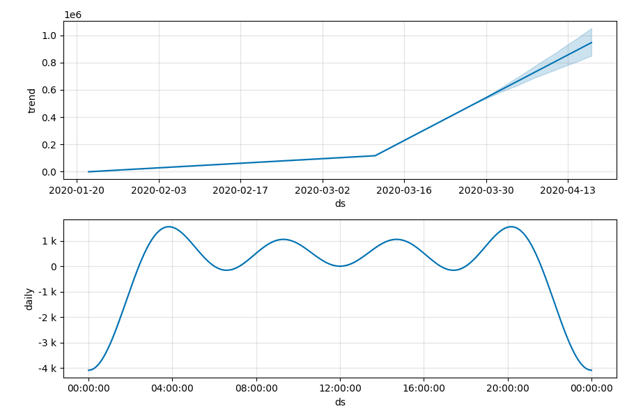
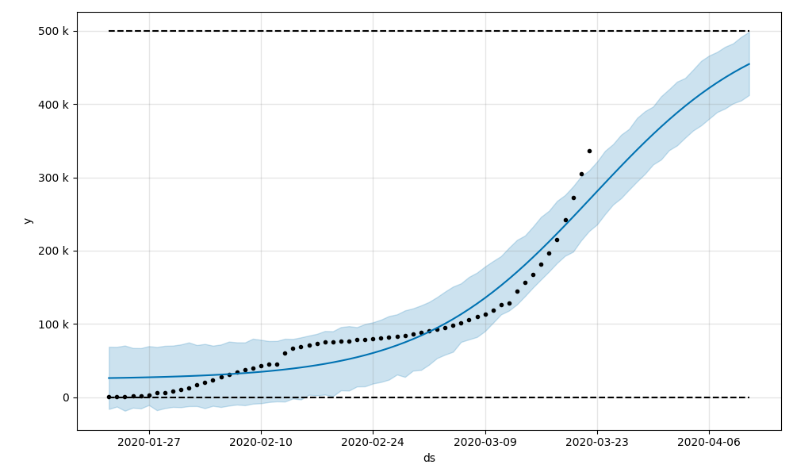
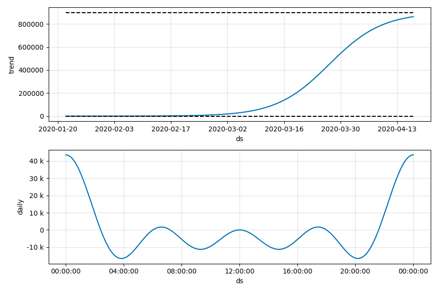
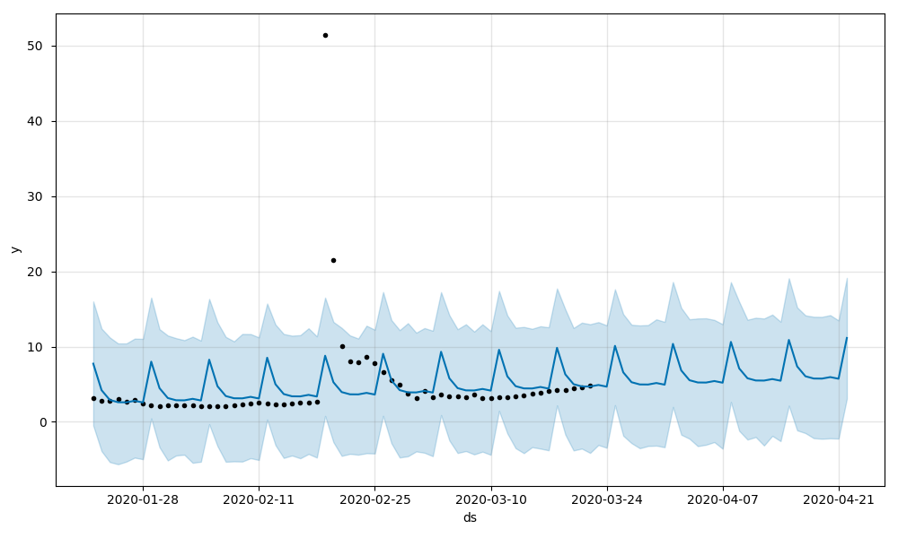
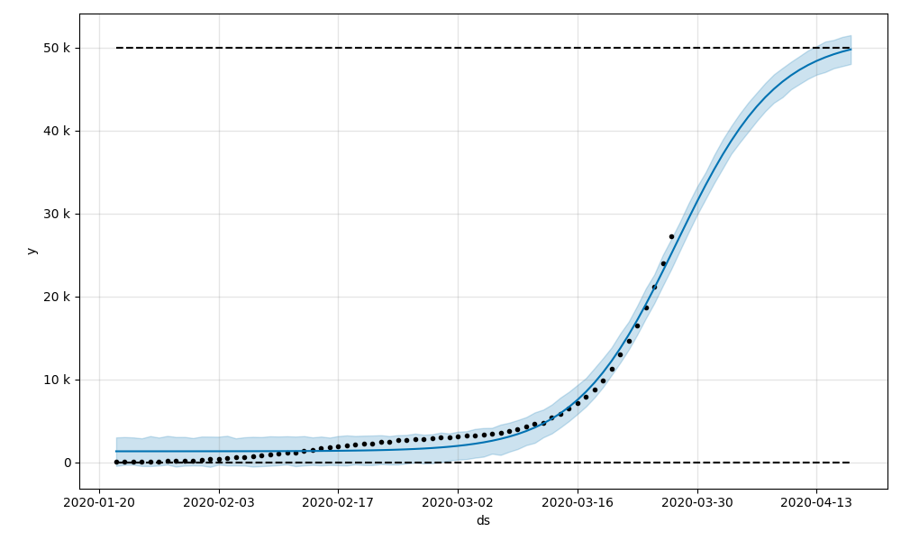

# COVID-19 Predictions

## Data Source
https://github.com/CSSEGISandData/COVID-19

## Overall Statistics

- Last update: 2020-03-28 00:00:00
- Total confirmed cases: 660706
- Total death cases: 30651
- Total active cases: 492178
- Total recovered cases: 137877
- Death rate %: 4.64

 | Country        |   Confirmed |   Deaths |   Recovered |   Active |   Death Rate |   Recovery Rate |
|:---------------|------------:|---------:|------------:|---------:|-------------:|----------------:|
| US             |      121478 |     2026 |           0 |   119452 |     1.66779  |        0        |
| Italy          |       92472 |    10023 |       12384 |    70065 |    10.839    |       13.3922   |
| Mainland China |       81401 |     3295 |       74978 |     3128 |     4.04786  |       92.1094   |
| Spain          |       73235 |     5982 |       12285 |    54968 |     8.16823  |       16.7748   |
| Germany        |       57695 |      433 |        8481 |    48781 |     0.750498 |       14.6997   |
| France         |       38105 |     2317 |        5724 |    30064 |     6.08057  |       15.0217   |
| Iran           |       35408 |     2517 |       11679 |    21212 |     7.10856  |       32.9841   |
| UK             |       17312 |     1021 |         151 |    16140 |     5.89764  |        0.872227 |
| Switzerland    |       14076 |      264 |        1530 |    12282 |     1.87553  |       10.8696   |
| Netherlands    |        9819 |      640 |           6 |     9173 |     6.51798  |        0.061106 |

## Overview 

Overview statistics for top affected countries.

## Global growth

Global growth rate of confirmed cases.

## Leaders

Confirmed cases for the most affected countries and Germany.

## Mortality

Percentage mortality (death rate) for top affected countries and Germany.

## Percentage Rates

Percentage rates for deaths, recovered cases and confirmed cases on a global scale. Mainland China is included.

# Predictions with Facebook Prophet

Predictions are performed using an additive forecasting model

where

represents the trend,

the periodic component,

holiday related events and

the error. The data are provided on a daily basis.
Also, the current model is not aware of holidays.

## Predictions for global confirmed cases.

### Linear model

### Logistic model

## Predictions for global death cases.

### Linear model

### Logistic model

## Predictions for global active cases.

### Linear model

### Logistic model

## Predictions for global recovered cases.

### Linear model

### Logistic model

### Predictions for total confirmed cases using a logistic model.

### Predictions for total confirmed cases using a logistic model.

Predictions for total confirmed cases using a linear model.

Components of linear forecasting model.

Predictions for total confirmed cases using a logistic model.

Components of logistic forecasting model.

Predictions for mortality rate.

Predictions for deaths using a logistic model.
