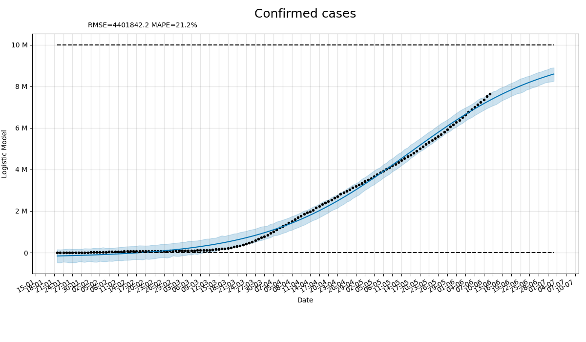

# COVID-19 Predictions

## Data Source
https://github.com/CSSEGISandData/COVID-19

## Overall Statistics

- Last update: 2020-03-30 00:00:00
- Total confirmed cases: 782365
- Total death cases: 37581
- Total active cases: 586328
- Total recovered cases: 158456
- Death rate %: 4.80

 | Country        |   Confirmed |   Deaths |   Recovered |   Active |   Death Rate |   Recovery Rate |
|:---------------|------------:|---------:|------------:|---------:|-------------:|----------------:|
| US             |      161807 |     2978 |           0 |   158829 |     1.84046  |        0        |
| Italy          |      101739 |    11591 |       14620 |    75528 |    11.3929   |       14.3701   |
| Spain          |       87956 |     7716 |       16780 |    63460 |     8.77257  |       19.0777   |
| Mainland China |       81478 |     3304 |       75790 |     2384 |     4.05508  |       93.019    |
| Germany        |       66885 |      645 |       13500 |    52740 |     0.964342 |       20.1839   |
| France         |       45170 |     3030 |        7964 |    34176 |     6.70799  |       17.6312   |
| Iran           |       41495 |     2757 |       13911 |    24827 |     6.64417  |       33.5245   |
| UK             |       22453 |     1411 |         171 |    20871 |     6.28424  |        0.761591 |
| Switzerland    |       15922 |      359 |        1823 |    13740 |     2.25474  |       11.4496   |
| Belgium        |       11899 |      513 |        1527 |     9859 |     4.31129  |       12.833    |

Rates are reported in percentage.

## Doubling Times for Confirmed Cases

The doubling time is time it takes for a population to double in size.
When the relative growth rate

for an exponentially growing population

is constant, the quantity undergoes exponential growth and has a constant doubling time or period,
which can be calculated directly from the growth rate as follows

For the coronavirus pandemia, the bigger doubling time (measured in days) the better is in terms of a slowing down spread.
Small values indicate steeply increasing populations.

### Today

|    | Country        |   Doubling Time |   Doubling Time Error |
|---:|:---------------|----------------:|----------------------:|
|  0 | Mainland China |        39.554   |             4.53451   |
|  1 | South Korea    |        15.387   |             1.19856   |
|  6 | Iran           |         8.08672 |             0.255562  |
|  4 | Italy          |         6.79855 |             0.207929  |
|  8 | Greece         |         6.45465 |             0.248193  |
|  9 | Cyprus         |         5.37158 |             0.23878   |
|  7 | France         |         5.02591 |             0.0898325 |
|  2 | Germany        |         4.82182 |             0.114185  |
|  5 | Spain          |         4.59721 |             0.103548  |
|  3 | US             |         3.43474 |             0.0649632 |

### As of 31 March 2020
|    | Country        |   Doubling Time |   Doubling Time Error |
|---:|:---------------|----------------:|----------------------:|
|  0 | Mainland China |        39.554   |             4.53451   |
|  1 | South Korea    |        15.387   |             1.19856   |
|  6 | Iran           |         8.08672 |             0.255562  |
|  4 | Italy          |         6.79855 |             0.207929  |
|  8 | Greece         |         6.45465 |             0.248193  |
|  9 | Cyprus         |         5.37158 |             0.23878   |
|  7 | France         |         5.02591 |             0.0898325 |
|  2 | Germany        |         4.82182 |             0.114185  |
|  5 | Spain          |         4.59721 |             0.103548  |
|  3 | US             |         3.43474 |             0.0649632 |

### As of 15 March 2020
Saving 'images/doubling_time/Greece.png'
|    | Country        |   Doubling Time |   Doubling Time Error |
|---:|:---------------|----------------:|----------------------:|
|  0 | Mainland China |        24.0957  |             2.61058   |
|  1 | South Korea    |         7.53423 |             0.530588  |
|  6 | Iran           |         4.46829 |             0.250428  |
|  4 | Italy          |         3.66472 |             0.0808904 |
|  8 | Greece         |         2.87314 |             0.214045  |
|  7 | France         |         2.7764  |             0.0668084 |
|  3 | US             |         2.54285 |             0.03191   |
|  2 | Germany        |         2.52113 |             0.0732814 |
|  5 | Spain          |         1.88387 |             0.0761202 |

### Germany Today

## Overview 

Overview statistics for top affected countries.

## Global growth

Global growth rate of confirmed cases.

## Leaders

Confirmed cases for the most affected countries and Germany.

## Mortality

Percentage mortality (death rate) for top affected countries and Germany.

## Percentage Rates

Percentage rates for deaths, recovered cases and confirmed cases on a global scale. Mainland China is included.

# Predictions with Facebook Prophet

Predictions are performed using an additive forecasting model

where
-  represents the trend
-  the periodic component
-  holiday related events
-  the error.

The data are provided on a daily basis.
Also, the current model is not aware of holidays.

Prophet allows you to make forecasts using a logistic growth trend model, with a specified carrying capacity which is indicated by a horizontal dashed line in each of the plots.

## Predictions for global confirmed cases

### Linear model
#### Global

#### Germany

### Logistic model
#### Global

#### Germany

## Predictions for global death cases

### Linear model

### Logistic model

## Predictions for global active cases

### Linear model

### Logistic model

## Predictions for global recovered cases

### Linear model

### Logistic model

## Predictions for global mortality rate

# Factor Analysis

## Logistic function
The spread of infectious disease can be modeled using a logistic curve rather than an exponential curve or a linear function. The growth starts exponentially, but must slow down after some point called the inflection point. The inflection point is essentially the midpoint of the spread. We attempt to model the number of COVID-19 cases using a logistic curve.

A logistic function or logistic curve is a common S-shaped curve (sigmoid curve) with equation

where

-  = the time variable
-  = the sigmoid's midpoint / inflection point 
-  = the curve's maximum value (plateau)
-  = the logistic growth rate or steepness of the curve

The following growth metrics can be considered for the confirmed cases for each country:

* Growth Factor =   with i=days, weeks, months, ...
* Growth Ratio
* Growth Rate
* 2nd Derivative

These growth metrics can be explored to gain insight into which countries may have already hit their inflection points.
For example, if a country's growth factor has stabilized around 1.0 then this can be a sign that that country has reached it's inflection point.  When fitting data with a logistic function, we may predict if a country has hit their inflection point, and therefore we can predict when they will reach a possible maximum number of confirmed cases.

